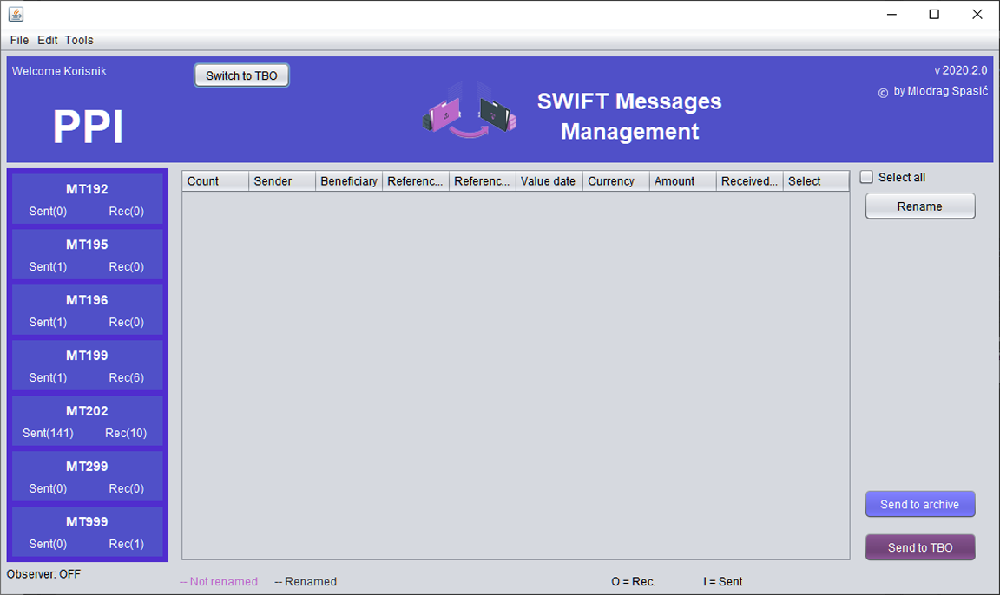
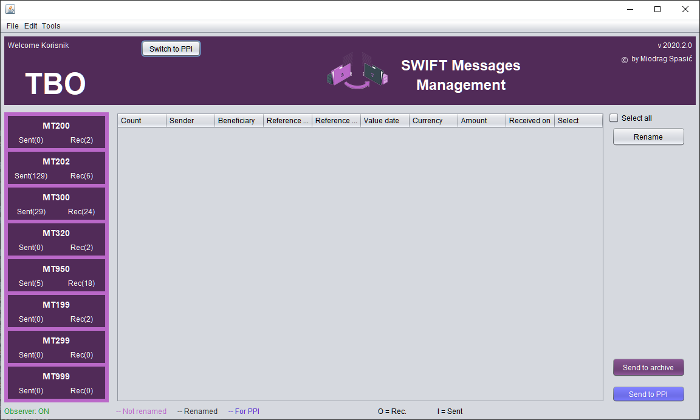

# SMM
### Swift Messages Management

SWIFT MESSAGES MANAGEMENT je aplikacija za menadzment swift poruka koje se ucitavaju u prethodno definisane direktorijume.  Aplikacija nema interakciju sa ostalim aplikacijama vec samo pristupa zadatim folderima koji sadrze swift poruke u pdf formatu, cita njihov sadrzaj, menja nazive fajlova, kopira i spaja fajlove. 

Uvodjenjem aplikacije postize se usteda radnog vremena, blagovremena informisanost o pristiglim porukama, evidencija obradjenih poruka. Takodje eliminise se potreba za stampom poruka.
  

 

### Mogu je koristiti TBO i PPI odeljenja. Trenutno dostupne funkcije koje aplikacija obavlja su:

- Pruzanje preglednih informacija o pristiglim porukama razvrstanih po vrstama

- Pregled i stampa teksta poruke

- Preimenovanje fajla sa ciljem da bude lako prepoznatljiv

- Arhiviranje (premestanje poruka u prethodno definisan direktorijum. Automatski raspored po vrstama poruke i po datumima

- Pregled arhiviranih poruka po datumu valute odnosno po datumu prijema poruke ako poruka ne sadrzi datum valute (npr. MT192, MT199, MT299 itd.)

- Premestanje lokacije swift poruke iz TBO u PPI i obrnuto

- Dobijanje notifikacije o pristigloj swift poruci

- Spajanje pdf dokumenta

### U planu:

- Formiranje elektronskog dosijea u TBO odeljenju, spajanjem poruka koje se odnose na istu transakciju

- Notifikacija PPI odeljenju o nerasknjizenim stavkama izvoda

- Statistika prometa poruka

- Raspored dnevnih obaveza zaposlenih od strane rukovodioca

